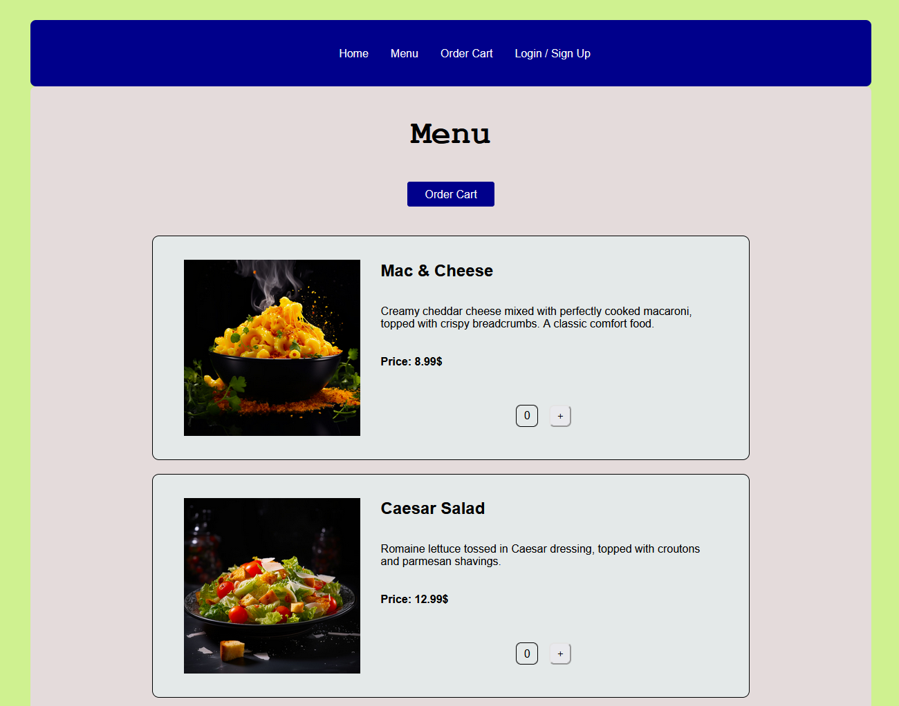

# React Dine 📅 

React Dine is a school project developed to learn and demonstrate skills in modern web techonologies.

# Technologies 🛠️

## Frontend

- React, Vite
- Javascript
- CSS
- React Router
- React Query
- React Redux

## Backend

- NodeJS
- Javascript
- Express
- MySQL
- Docker
- Jest

## Running

You need three console windows. One for frontend, one for backend and one for the Docker MySQL database.

- run `docker-compose up`
- run `npm install` in both frontend and backend
- run `npm run dev` in both frontend and backend

The application requires the following environment variables to be set:

`env` values in backend:

- `MYSQL_HOST`: The hostname of your MySQL database server (e.g., `localhost`)
- `MYSQL_USERNAME`: The username for your MySQL database (e.g., `root`)
- `MYSQL_PASSWORD`: The password for your MySQL database (e.g., `dine_password`)
- `MYSQL_DATABASE`: The name of your MySQL database (e.g., `react_diner_db`)
- `JWT_KEY`: The secret key used for JSON Web Token (JWT) authentication (e.g., `not_so_secret`)

`env` values in frontend:

- `VITE_API_URL`: The base URL for the backend API (e.g., `http://localhost:5000`)

